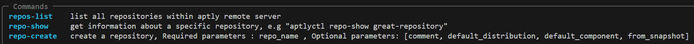
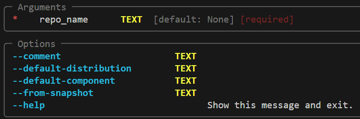

# aptlyctl
aptly is an apt repository manager, it is quite a small project which gained a fair amount of user-base but is lacking in terms of CLI.


# Motivation
The need for this project has arised due to the fact that the existing aptly CLI projects are not maintained for many years and aren't documented properly.


## Pyinstaller
This project uses pyinstaller in order to build and distribute this CLI easily with no hassle and CI in mind.

## Makefile 
Makefile is used in order to clean, build, and add aptlyctl to $PATH

```
make clean
make build
make pathly
```


## Authentication
This CLI is written with authentication and developed with this docker image of aptly :https://github.com/urpylka/docker-aptly, it wasn't tested without it, therefore you must provide the following in order for the CLI to authenticate with aptly and your aptly setup must support authentication.

```
export API_USER
export API_PASS
export GPG_PASSPHRASE
```

## CLI arguments
each command documents what parameters are optional and what are mandatory using built-in capabilities of typer, this allows you to get up and running with aptly with minimal knowledge

To get all available commands type :
```
aptlyctl --help
```


To get all available options of a certain command type :
```
aptlyctl command --help (e.g aptlyctl repo-create --help)
```
